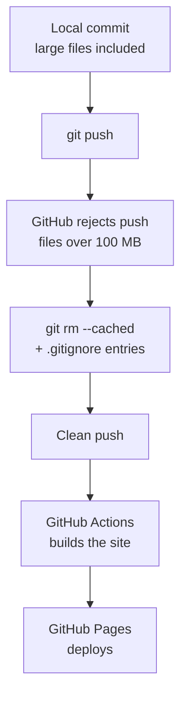

{{ post_nav(page.url) }}

I've spent my career producing user guides, installation guides, and quick reference guides in FrameMaker — unstructured, PDF-first, built for print. This site is my first real step into docs-as-code: writing in Markdown, storing content in Git, and letting a build pipeline generate the actual pages.

## Before: what Zensical gives you out of the box

Running `zensical new` scaffolds a working local site immediately — `zensical serve` builds and previews it, no configuration required. The scaffold even includes a `.github/workflows/docs.yml` file already wired to run `zensical build` on every push to `main`. Deployment looks mostly solved before you've written a line of your own config.

Two things aren't automatic, though: GitHub Pages needs its **Source** setting switched from the default branch-based deploy to **GitHub Actions** in the repo's Settings, and Zensical's scaffold assumes your content is small enough to fit inside GitHub's normal size limits without checking.

## The challenge: a rejected push

My first `git push` failed outright. Three portfolio sample PDFs — scanned government technical manuals — were 53 MB, 127 MB, and 137 MB. GitHub warns above 50 MB and hard-blocks anything over 100 MB. Nothing reached the server; the whole push was rejected.

## The theory behind the fix

Git tracks every version of every file it's told to track, forever. The fix isn't to shrink the files after the fact — it's to stop Git from tracking them at all, using `.gitignore`, and to remove them from files already staged with `git rm --cached` (which untracks a file without deleting it from disk).



## Code changes, by file

**`.gitignore`** — added the three oversized files by exact relative path, so they stay on disk locally but never enter version control:

```
docs/portfolio/TM-9-2320-366-20-1.pdf
docs/portfolio/TM-9-2320-365-20-1.pdf
docs/portfolio/TM-9-2320-366-10-1.pdf
```

**Terminal, one-time cleanup:**

```
git rm --cached "docs/portfolio/TM-9-2320-366-20-1.pdf" "docs/portfolio/TM-9-2320-365-20-1.pdf" "docs/portfolio/TM-9-2320-366-10-1.pdf"
git commit --amend --no-edit
git push
```

**GitHub Settings → Pages** — Source set to **GitHub Actions** (one-time, UI only, no file change).

## After

The push succeeded, the Actions workflow ran green, and the site went live at [edwardmcham.github.io](https://edwardmcham.github.io/) — visible right now, with working navigation across Blog, Resume, and Portfolio.

**GitHub Actions run:** [github.com/edwardmcham/edwardmcham.github.io/actions/runs/28564549018](https://github.com/edwardmcham/edwardmcham.github.io/actions/runs/28564549018)

{{ post_nav(page.url) }}
