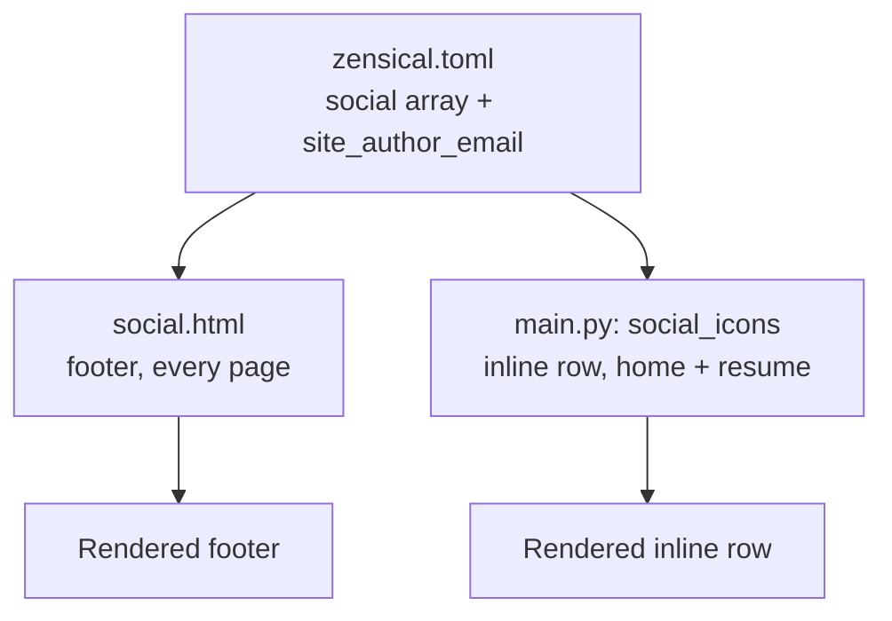

{{ post_nav(page.url) }}

Single-sourcing is a familiar idea from my FrameMaker work — one source file, multiple outputs, so a change in one place doesn't mean hunting down every duplicate. This site needed the same discipline for my contact links.

## Before

Zensical's `[[project.extra.social]]` array in `zensical.toml` already lets you list social/contact links once, and its built-in footer template renders them automatically on every page. That part is native and works well.

## The challenge

I also wanted the same icon row at the top of my home and resume pages — not just the footer. Copy-pasting the row into two Markdown files meant two places to edit every time a link changed, which defeats the entire point of single-sourcing. Worse, my email address itself existed as a literal string in the TOML `link` field, with no config-level way to reference it from anywhere else.

## The theory behind the fix

Zensical's Macros extension lets a Markdown page call a Python function by name. The function can read the exact same `config.extra.social` array the footer already uses, so both the footer and any inline row render from one source. Separately, I overrode the footer template itself so the *email* icon specifically builds its link from one dedicated `site_author_email` setting, rather than the array's `link` field at all.



## Code changes, by file

**`zensical.toml`** — the array itself; email's `link` is intentionally blank:
```toml
[[project.extra.social]]
icon = "fontawesome/solid/envelope"
link = ""
name = "Email »"
```

**`main.py`** — the macro that builds the inline row:
```python
def define_env(env):
    @env.macro
    def social_icons():
        extra = env.conf.get("extra", {})
        social = extra.get("social", [])
        email = extra.get("site_author_email", "")
        # ...builds one <a> tag per entry, using email for the envelope icon
```

**`overrides/partials/social.html`** — one added line in the footer template:
```jinja

  

```

## After

The home page and resume page both show an identical, correctly-ordered icon row, matching the footer exactly. Changing my email address now means editing exactly one setting, anywhere on the site.

See it live: [edwardmcham.github.io](https://edwardmcham.github.io/) and [/resume/](https://edwardmcham.github.io/resume/) — same row, same source.

**GitHub Actions run:** [github.com/edwardmcham/edwardmcham.github.io/actions/runs/28714707973](https://github.com/edwardmcham/edwardmcham.github.io/actions/runs/28714707973)

{{ post_nav(page.url) }}
