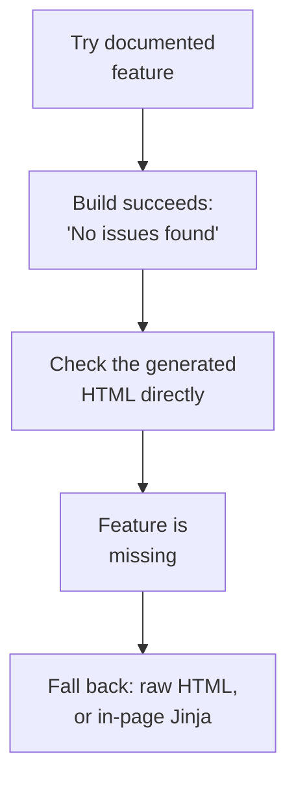

{{ post_nav(page.url) }}

Zensical is versioned 0.0.46 as I write this — deliberately so. Its own FAQ is upfront that it's still closing a feature-parity gap with the more mature tool it's meant to replace. That mattered more than I expected while building this site.

## Before

Zensical's documentation describes Snippets (embedding one file inside another), Admonition (styled callout boxes), and attr_list (adding custom HTML attributes to Markdown elements) as supported extensions, with syntax matching Material for MkDocs.

## The challenge

All three, enabled exactly as documented, produced the same result: `zensical build` reported "No issues found," and the feature simply didn't appear in the rendered page. No error, no warning — just silently missing output. I confirmed this by checking the actual built HTML file directly rather than trusting the browser:

```
findstr /n "expected-text" site\index.html
```

If the expected text isn't in that file, the build "succeeding" is beside the point.

## The theory behind the fix

Rather than debug Zensical's internals at 0.0.x, I fell back to lower-level mechanisms that Python-Markdown supports natively and that proved reliable every time: raw HTML passthrough, and Jinja variables placed directly in a page's own source. One specific rule mattered here — Macros only processes a page's *own* Markdown source, before Snippets expands any included file. A variable placed inside an included file never gets evaluated; the same variable placed directly in the page that calls the include works correctly.



## Code changes, by file

**`docs/index.md`** — the email link lives directly in this file's own source, not inside an include, specifically so the Jinja variable for the site's email address resolves correctly:
```markdown
[:fontawesome-solid-envelope:](mailto:SITE_AUTHOR_EMAIL_VARIABLE "Email")
\--8<-- "../includes/hero.html"
```

**`includes/hero.html`** — deliberately plain HTML, no Markdown syntax or Jinja calls inside it:
```html
<div class="hero">
  
  ...
</div>
```

## After

The hero layout and the dynamic email link both work reliably now — through a different mechanism than first attempted, not through Zensical fixing anything.

See it live: [edwardmcham.github.io](https://edwardmcham.github.io/)

{{ post_nav(page.url) }}
